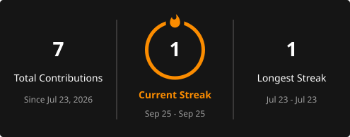

# Hi, I'm Shariq 👋

---

### 🧑‍💻 About Me

I'm a Computer Science student who likes figuring things out the hard way first — solve it myself, then go looking for a better approach and refine it. Right now I'm deep into OOP, Data Structures & Algorithms, Database Design, and just generally getting comfortable building real, working software instead of textbook examples.

- 🎓 BSCS Student at **Minhaj University Lahore**
- 🔭 Practicing **OOP, DSA, Database Design, and Problem Solving**
- 🚀 Interested in **Software Development, Databases, and practical projects**
- 🌱 Learning by **building and experimenting**, not just reading

---

### 🛠️ Tech Stack

**Languages**

**Tools**

---

### 🎯 Goals

- Build practical software projects
- Strengthen programming fundamentals
- Master OOP and Data Structures
- Improve problem-solving skills
- Contribute to open-source projects

---

### 🏆 GitHub Trophies

### 📊 GitHub Stats

---

### 🌐 Connect With Me

📫 Always open to collaborate on interesting projects — feel free to reach out!

⭐ Thanks for visiting my profile!

